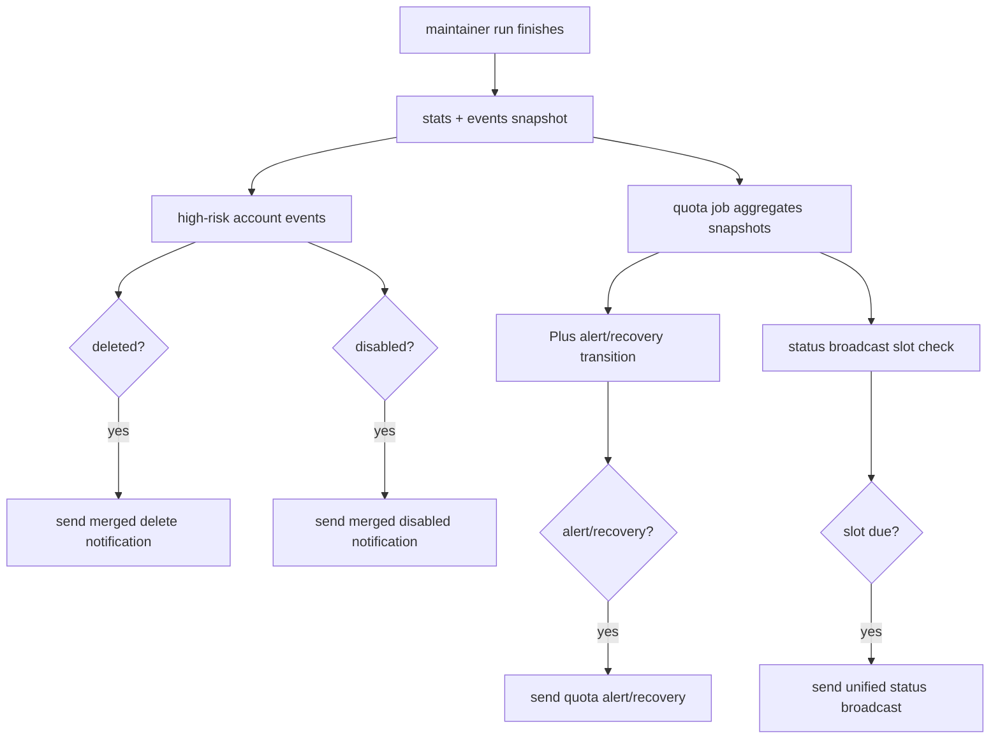

# CPACodexKeeper 通知整合与降噪实现计划

## Overview

把现有飞书通知从“每轮流水账 + 两套日报”调整为“实时高风险通知 + 统一定时播报”。实现后，删除和禁用仍会实时可见，但同一轮合并发送；启用、刷新、普通轮次统计不再实时打扰；账号状态和 quota 平均额度合并为多时段“定时播报”。所有通知标题都带服务器名称，支持多台机器部署区分来源。

## Problem Frame

生产环境中 `CPACodexKeeper 轮次变更通知` 可能每半小时发送一次，尤其在启用/刷新等正常维护动作频繁时，会把飞书变成低价值流水账。当前还有 `CPACodexKeeper 日报` 与 `CPA Codex 额度日报` 两套摘要，内容都包含账号数量和可用状态，存在重复。需求文档已明确：实时通知只保留删除、禁用、额度告警/恢复和异常；其他状态进入统一定时播报（see origin: `docs/brainstorms/cpacodexkeeper-notification-consolidation-requirements.md`）。

## Requirements Trace

- R1-R2. 通知标题包含可配置服务器名称，未配置时使用默认名称。
- R3-R4. 删除实时通知，同轮多个删除合并。
- R5-R6. 禁用实时通知，同轮多个禁用合并。
- R7-R8. 启用与刷新不实时通知，只进入定时播报。
- R9-R10. Plus 额度告警/恢复继续实时通知。
- R11. CPA API、usage 大面积失败、连续网络失败/恢复、巡检异常、进程异常退出继续实时通知。
- R12-R17. 账号状态日报与额度日报合并为多时段定时播报，默认东八区，包含账号巡检统计、quota 概况和删除/禁用名单摘要。
- R18-R19. 普通轮次变更不再实时推送；正常维护动作不单独打扰。
- R20. 保留受控测试通知，用于上线前验证消息格式和飞书 transport。

## Scope Boundaries

- 不改变 token 删除、禁用、启用、刷新业务规则。
- 不新增外部通知渠道，不新增第二套 scheduler、cron、sidecar 或服务。
- 不把完整 token 级审计日志塞进飞书；详细流水继续依赖容器日志。
- 不让通知 cooldown 状态承担 quota alert 或 broadcast 领域状态。
- 不要求完全移除旧配置项；优先兼容迁移，避免线上 `.env` 静默失效。

## Context & Research

### Relevant Code and Patterns

- `src/notifier.py`：当前 Feishu transport、cooldown、连续失败状态、账号变更日报都在这里。
- `src/maintainer.py`：每轮巡检收集 `stats` 与 `events`，当前在 `_notify_post_run()` 里依次发送大面积失败、失败状态、轮次变更、账号日报，然后运行 quota job。
- `src/quota_job.py`：当前负责 quota 聚合、quota 日报、Plus 告警/恢复状态机。
- `src/quota_report.py`：已有 quota 聚合与消息行构造，可复用其平均剩余、可用数、最早重置时间展示。
- `src/quota_state.py`：已有 quota alert 与 summary 状态文件，适合作为“定时播报槽位”的领域状态承载点。
- `src/settings.py`、`.env.example`、`docker-compose.yml`：配置新增和 Docker 环境变量透传必须同步更新。
- `tests/test_maintainer.py`、`tests/test_quota_job.py`、`tests/test_quota_report.py`、`tests/test_quota_state.py`、`tests/test_settings.py`、`tests/test_docker_compose.py`：已有测试覆盖通知触发、quota 状态隔离、配置解析和 compose 透传。

### Institutional Learnings

- CPACodexKeeper 是会执行真实写操作的 daemon，通知、配置、并发统计、dry-run/once/daemon 边界都必须可验证。
- 通知 transport 可以复用同一个 Feishu webhook，但业务状态不能塞进 notifier cooldown；quota/broadcast 状态应继续使用独立领域状态文件。
- quota healthcheck 应继续作为 maintainer 每轮结束后的 post-run job，不新增第二个线上调度源。
- 生产部署可信度来自本地测试、容器测试、真实日志和状态文件检查，而不是仅看容器 running。

### External References

- 不需要外部研究。此计划主要重组现有 Python 标准库代码、已有 Feishu transport、已有 quota aggregation 和现有 unittest 覆盖；本地模式足够。

## Key Technical Decisions

- **统一标题前缀放在 notifier transport 层。** `FeishuNotifier.send()` 或其内部标题构造统一加服务器名，避免每个调用点重复拼接并漏掉异常通知。
- **新增 `CPA_SERVER_NAME`。** 默认建议为 `cpacodexkeeper`；生产多机部署通过 `.env` 改成如 `sub2api-prod`、`gcp-hk-01`。
- **新增 broadcast 配置，但保留旧配置兼容。** 推荐配置项为 `CPA_STATUS_BROADCAST_ENABLED`、`CPA_STATUS_BROADCAST_HOURS_LOCAL`、`CPA_STATUS_BROADCAST_TIMEZONE`；旧的 `FEISHU_NOTIFY_SEND_DAILY_SUMMARY` / `FEISHU_NOTIFY_DAILY_SUMMARY_HOURS_UTC` 作为兼容输入，不再作为新文档主入口。
- **定时播报默认东八区。** 默认 timezone 用东八区 IANA 名称；若生产明确配置其他时区，则按配置计算本地小时。
- **定时播报状态继续走 quota/state 领域状态。** 可以把现有 `summary_state` 兼容迁移到 `broadcast_state`，避免把业务播报槽位写进 `notify_state.json`。
- **先聚合 quota，再决定通知。** `_notify_post_run()` 需要拿到 quota aggregation/evaluation 后，才能生成统一定时播报；Plus alert/recovery 仍沿用 quota 状态机实时发送。
- **删除/禁用从逐 token 通知改为轮次合并通知。** `process_token` 只记录事件；轮次结束后按 `events.deleted` 和 `events.disabled` 各发一条合并通知。
- **刷新和启用只记录事件。** 不再调用实时 `notify_refresh`，不再因为启用/刷新触发“轮次变更通知”。
- **受控测试覆盖新消息。** 保留现有 alert/recovery 测试，新增或改造 summary 为 broadcast 测试，并增加删除/禁用合并消息样例。

## Open Questions

### Resolved During Planning

- **服务器名称配置项命名：** 使用 `CPA_SERVER_NAME`。它是跨所有通知的身份信息，不绑定 Feishu，因此不使用 `FEISHU_` 前缀。
- **定时播报配置项：** 使用 `CPA_STATUS_BROADCAST_*` 作为新主配置；旧 daily summary 配置作为兼容迁移来源。
- **定时播报状态归属：** 使用 quota/state 领域状态文件，而不是 notifier cooldown state。
- **测试通知范围：** 至少覆盖 broadcast、alert、recovery、deleted、disabled 五类消息。

### Deferred to Implementation

- **旧 UTC hours 到 local hours 的精确兼容方式：** 实现时读取配置来源后决定是否转换显式旧配置；若难以区分默认值和显式值，应优先在 README 中要求生产 `.env` 写明新配置。
- **消息截断阈值：** 具体展示前 20 个还是 30 个 token 可在实现时按现有 `names[:20]` 模式确定。
- **`summary_state` 到 `broadcast_state` 的落盘兼容细节：** 实现时根据现有 state JSON 结构写最小迁移逻辑。

## High-Level Technical Design

> *This illustrates the intended approach and is directional guidance for review, not implementation specification. The implementing agent should treat it as context, not code to reproduce.*

## Implementation Units

- [x] **Unit 1: 配置与标题身份**

**Goal:** 增加服务器名称和定时播报配置，并确保所有通知标题自动带服务器名。

**Requirements:** R1, R2, R13, R14

**Dependencies:** None

**Files:**
- Modify: `src/settings.py`
- Modify: `src/notifier.py`
- Modify: `.env.example`
- Modify: `docker-compose.yml`
- Test: `tests/test_settings.py`
- Test: `tests/test_docker_compose.py`

**Approach:**
- 在 `Settings` 增加 `server_name`、`status_broadcast_enabled`、`status_broadcast_hours_local`、`status_broadcast_timezone`。
- 新主配置使用 `CPA_SERVER_NAME`、`CPA_STATUS_BROADCAST_ENABLED`、`CPA_STATUS_BROADCAST_HOURS_LOCAL`、`CPA_STATUS_BROADCAST_TIMEZONE`。
- 默认服务器名使用稳定低风险值，例如 `cpacodexkeeper`。
- 默认时区使用东八区 IANA 名称；默认小时建议保持旧配置等价的东八区多时段，降低生产迁移惊讶。
- 在 notifier 标题构造处统一加前缀，例如 `[server-name] 原标题`；测试通知和异常通知都应自动受益。
- 保留旧 `FEISHU_NOTIFY_*DAILY_SUMMARY*` 解析，作为迁移兼容或废弃配置；README 中明确新配置优先。

**Patterns to follow:**
- `src/settings.py` 现有 `_read_bool`、`_read_csv_ints`、`_read_int` 校验模式。
- `docker-compose.yml` 现有 `${VAR:-default}` 透传模式。

**Test scenarios:**
- Happy path: `.env` 设置 `CPA_SERVER_NAME=sub2api-prod` -> `Settings.server_name` 为 `sub2api-prod`，通知标题包含 `[sub2api-prod]`。
- Happy path: `.env` 设置 `CPA_STATUS_BROADCAST_HOURS_LOCAL=8,12,18,23` -> settings 解析为去重排序后的小时元组。
- Edge case: 未设置新配置 -> 使用默认服务器名、默认东八区、多时段小时。
- Error path: `CPA_STATUS_BROADCAST_HOURS_LOCAL=24` 或非整数 -> 抛出配置错误。
- Integration: `docker-compose.yml` 暴露 `CPA_SERVER_NAME` 和 `CPA_STATUS_BROADCAST_*`。

**Verification:**
- 配置测试通过；mock 发送时所有标题都带服务器名前缀；compose 测试确认新变量可注入容器。

- [x] **Unit 2: 合并删除/禁用实时通知，移除普通轮次变更实时推送**

**Goal:** 删除和禁用按轮次合并发送；启用、刷新和普通轮次统计不再触发实时通知。

**Requirements:** R3, R4, R5, R6, R7, R8, R18, R19

**Dependencies:** Unit 1

**Files:**
- Modify: `src/maintainer.py`
- Modify: `src/notifier.py`
- Test: `tests/test_maintainer.py`

**Approach:**
- 移除或停止调用逐 token `notify_delete` 和 `notify_refresh` 的实时发送路径，让 token 处理阶段只记录事件。
- 禁用事件需要补充原因摘要，至少保留 token 名称、email、触发的 quota 窗口/阈值信息；删除事件继续保留 reason/status/detail。
- 用新的合并通知方法替代 `notify_round_changes`，例如 `notify_high_risk_account_changes(stats, events)`。
- 合并通知分两类标题：删除通知和禁用通知；同一轮同时有删除和禁用时可发两条，保证高风险类别清晰。
- 启用和刷新仍记录到 `events`，供定时播报展示，但不会触发实时消息。
- 保留大面积 usage、连续失败、CPA API 异常等既有异常通知路径。

**Patterns to follow:**
- `src/maintainer.py` 现有 `_record_event` 和 `_events_snapshot` 模式。
- `src/notifier.py` 现有 `names[:20]` 截断模式。

**Test scenarios:**
- Happy path: 本轮 1 个删除 -> 只发送 1 条删除通知，包含 token 名称和原因。
- Happy path: 本轮多个删除 -> 只发送 1 条删除通知，列出多个名称，数量正确。
- Happy path: 本轮 1 个禁用 -> 只发送 1 条禁用通知，包含 token 名称和原因摘要。
- Happy path: 本轮多个禁用 -> 只发送 1 条禁用通知，列出多个名称，数量正确。
- Edge case: 本轮只有启用 -> 不发送实时账号变更通知。
- Edge case: 本轮只有刷新 -> 不发送实时账号变更通知。
- Integration: 本轮删除 + 禁用 + 启用 + 刷新 -> 实时只发删除和禁用两类，启用/刷新只留在 events。

**Verification:**
- 维护流程测试能证明生产中不会再因普通启用/刷新触发半小时一条 `CPACodexKeeper 轮次变更通知`。

- [x] **Unit 3: quota job 返回聚合结果并保留实时告警/恢复状态机**

**Goal:** 让 maintainer 能用同一份 quota 聚合结果生成定时播报，同时不破坏 Plus 告警/恢复的实时状态机。

**Requirements:** R9, R10, R16

**Dependencies:** Unit 1

**Files:**
- Modify: `src/quota_job.py`
- Modify: `src/quota_state.py`
- Modify: `src/quota_report.py`
- Test: `tests/test_quota_job.py`
- Test: `tests/test_quota_state.py`
- Test: `tests/test_quota_report.py`

**Approach:**
- 将 `QuotaHealthcheckJob.run()` 的职责调整为：聚合 snapshots、评估 alert、发送 alert/recovery、返回聚合结果给 maintainer。
- 移除 quota job 内部单独发送 `CPA Codex 额度日报` 的路径，避免与统一定时播报重复。
- 保留 alert/recovery transition 的“发送成功才提交状态”规则。
- 在 `QuotaHealthcheckState` 中把 summary 槽位语义扩展/迁移为 broadcast 槽位；旧 state 文件可继续读取。
- `build_alert_lines` 和 `build_recovery_lines` 继续复用，标题通过 Unit 1 自动加服务器名。

**Patterns to follow:**
- `tests/test_quota_job.py` 现有“发送失败不推进状态”“quota state 不污染 notify_state”的测试。

**Test scenarios:**
- Happy path: quota alert 从 NORMAL 进入 ALERTING -> 实时告警发送成功后状态变为 ALERTING。
- Happy path: quota recovery 从 ALERTING 回 NORMAL -> 恢复通知发送成功后状态变为 NORMAL。
- Edge case: alert 发送失败 -> alert_state 不推进。
- Edge case: recovery 发送失败 -> 保持 ALERTING。
- Integration: quota job 不再发送旧 `CPA Codex 额度日报`，但返回 agg 供定时播报使用。
- Regression: quota 状态仍写入 `quota_state_file`，不创建或污染 `notify_state_file`。

**Verification:**
- quota job 子测试证明 alert/recovery 语义不变，旧 quota 日报被统一播报替代。

- [x] **Unit 4: 统一定时播报生成与调度**

**Goal:** 生成一条同时包含账号巡检统计和 quota 概况的多时段定时播报。

**Requirements:** R12, R13, R14, R15, R16, R17, R18, R19

**Dependencies:** Unit 2, Unit 3

**Files:**
- Modify: `src/maintainer.py`
- Modify: `src/notifier.py`
- Modify: `src/quota_state.py`
- Modify: `src/quota_report.py`
- Test: `tests/test_maintainer.py`
- Test: `tests/test_quota_state.py`
- Test: `tests/test_quota_report.py`

**Approach:**
- `_notify_post_run()` 顺序改为：异常类通知 -> quota aggregation/alert -> 删除/禁用合并通知 -> 定时播报检查与发送。
- 新增统一播报消息构造，内容包括：账号统计、删除/禁用/启用/刷新名单摘要、网络失败、Plus / Free quota 指标、Unknown 数量。
- 定时播报按 `status_broadcast_hours_local` 和 `status_broadcast_timezone` 判断；同一天同一小时槽只发一次。
- 旧 `maybe_send_daily_summary(stats)` 不再作为独立发送入口；可以删除、改名或仅保留为兼容 wrapper，但不能再发送旧 `CPACodexKeeper 日报`。
- 播报标题使用 `CPA Codex 定时播报`，服务器名前缀由 notifier 统一处理。
- 如果 quota report disabled，播报仍可发送账号统计，但 quota 区块应明确显示未启用或不可用；计划实现时优先保证默认启用路径。

**Patterns to follow:**
- `src/quota_report.py` 现有 `build_daily_summary_lines` 的分区结构。
- `src/notifier.py` 现有 maintainer daily summary 的统计字段。

**Test scenarios:**
- Happy path: 到达配置小时且有 quota agg -> 发送一条 `CPA Codex 定时播报`，同时包含账号统计和 Plus/Free 平均额度。
- Happy path: 同一小时槽第二次运行 -> 不重复发送。
- Happy path: 不同配置小时到达 -> 可以再次发送。
- Edge case: 本轮有删除/禁用/启用/刷新 -> 播报包含名单摘要；启用/刷新只在播报出现，不实时出现。
- Edge case: 名单超过截断阈值 -> 播报列出前 N 个并提示截断。
- Edge case: quota disabled 或没有 snapshots -> 播报不崩溃，明确 quota 信息不可用。
- Integration: 原账号日报和原 quota 日报不会同时发送，只有统一定时播报。

**Verification:**
- 定时播报测试覆盖多时段、东八区、去重、内容合并和旧日报不再发送。

- [x] **Unit 5: 受控测试通知与 CLI 验证样例**

**Goal:** 扩展上线前可控验证，不进入真实 maintainer 主流程即可检查新消息格式。

**Requirements:** R20

**Dependencies:** Unit 1, Unit 2, Unit 4

**Files:**
- Modify: `src/cli.py`
- Modify: `src/quota_job.py`
- Modify: `src/notifier.py`
- Test: `tests/test_cli.py`
- Test: `tests/test_quota_job.py`

**Approach:**
- 扩展 `--quota-test` 或新增更中性的 `--notify-test`。如果保持最小变更，先在现有 `--quota-test` choices 中加入 `broadcast`、`deleted`、`disabled`。
- 测试消息必须使用 fake aggregate 和 fake events，不触发真实 CPA 写操作。
- 测试标题同样带服务器名前缀，方便验证多机配置。
- 测试状态继续使用隔离 state 文件；不要污染生产 quota state 或 notify state。

**Patterns to follow:**
- `src/quota_job.py` 现有 `fake_aggregate()` 与 `run_test_notification()`。
- `tests/test_quota_job.py` 现有 controlled test notification 测试。

**Test scenarios:**
- Happy path: `--quota-test broadcast` -> 发送 `[TEST] CPA Codex 定时播报`，包含账号统计和 quota 平均额度。
- Happy path: `--quota-test deleted` -> 发送 `[TEST] CPA Codex 删除通知`，包含多个 fake token。
- Happy path: `--quota-test disabled` -> 发送 `[TEST] CPA Codex 禁用通知`，包含多个 fake token。
- Regression: `--quota-test alert/recovery` 继续可用。
- Error path: unsupported mode 仍返回非成功或解析失败。

**Verification:**
- CLI/parser 测试覆盖新 choices；测试通知不进入 maintainer 主流程。

- [x] **Unit 6: 文档、部署配置与上线说明**

**Goal:** 让生产 `.env`、Docker 部署和 README 与新通知语义一致，避免线上仍按旧日报/轮次通知理解。

**Requirements:** R1-R20

**Dependencies:** Unit 1-5

**Files:**
- Modify: `README.md`
- Modify: `README.en.md`
- Modify: `.env.example`
- Modify: `docker-compose.yml`
- Test: `tests/test_docker_compose.py`

**Approach:**
- README 中把“日报”章节改为“定时播报与告警”，说明四类实时通知：删除、禁用、额度告警/恢复、异常。
- 明确启用/刷新只进定时播报，不实时发送。
- 给出多机部署示例：`CPA_SERVER_NAME=sub2api-prod`。
- 给出默认东八区、多时段配置示例。
- 说明旧 `FEISHU_NOTIFY_DAILY_SUMMARY_*` 是否仍兼容以及建议迁移到 `CPA_STATUS_BROADCAST_*`。
- 上线验证强调观察 daemon 下一轮日志与受控测试通知，不要并行启动第二个 maintainer。

**Patterns to follow:**
- README 现有 Docker、quota report、受控测试通知章节。

**Test scenarios:**
- Test expectation: documentation-only behavior verified through config/compose tests in Unit 1 and Unit 5.

**Verification:**
- README 与 `.env.example` 对齐；compose 测试确认新增变量暴露；文档不再承诺旧的独立账号日报/额度日报。

## System-Wide Impact

- **Interaction graph:** `maintainer.run()` 的 post-run 通知顺序会变化；quota aggregation 需要先完成，才能生成统一播报。
- **Error propagation:** quota report 失败不应阻断删除/禁用/异常通知；若 quota aggregation 失败，应记录日志并允许账号侧高风险通知继续发送。
- **State lifecycle risks:** broadcast 槽位状态不能写进 `notify_state.json`；alert/recovery 仍需遵守“发送成功才提交状态”。
- **API surface parity:** CLI 测试模式、`.env.example`、Docker compose 和 README 必须同步，否则生产部署会出现本地可用但容器缺变量的问题。
- **Integration coverage:** 需要覆盖 maintainer post-run 整体路径，而不仅是单个 notifier 方法。
- **Unchanged invariants:** token 生命周期策略、quota 阈值语义、Feishu webhook/secret/keyword transport、runtime 持久化、dry-run/once/daemon 模式边界不变。

## Risks & Dependencies

| Risk | Mitigation |
|------|------------|
| 合并通知后删除/禁用要等轮次结束才发，极端进程崩溃可能丢失本轮实时通知 | 保留容器日志作为审计；异常退出通知继续保留；实现时尽量确保 token 任务异常不阻断 post-run |
| 旧 `.env` 仍使用 UTC daily summary 配置，迁移后播报时间变化 | 新配置优先，旧配置兼容；README 明确生产推荐写入 `CPA_STATUS_BROADCAST_HOURS_LOCAL` |
| 把 broadcast 状态误写进 notifier state，导致 cooldown 和业务状态互相污染 | 计划明确使用 quota/domain state；测试断言不污染 `notify_state.json` |
| quota aggregation 失败导致统一播报缺失 | post-run 捕获 quota 异常，账号高风险通知继续发送；播报可降级显示 quota 不可用 |
| 消息过长被飞书截断 | 名单摘要截断并显示总数；完整细节保留在容器日志 |
| 多机部署服务器名未配置导致来源不清 | 默认标题仍有 `[cpacodexkeeper]`；部署文档要求每台机器配置唯一 `CPA_SERVER_NAME` |

## Documentation / Operational Notes

- 部署前更新生产 `.env`，至少配置 `CPA_SERVER_NAME`。
- 推荐显式配置 `CPA_STATUS_BROADCAST_HOURS_LOCAL`，避免依赖旧 UTC 配置迁移。
- 继续持久化 `runtime/`；不要把 state 文件打进镜像。
- 受控测试使用隔离 state 文件验证 broadcast/alert/recovery/deleted/disabled，不并行运行真实 `--once` maintainer。
- 部署后观察下一轮日志，应能看到 quota report generated 与定时播报/告警决策日志。

## Sources & References

- **Origin document:** [docs/brainstorms/cpacodexkeeper-notification-consolidation-requirements.md](../brainstorms/cpacodexkeeper-notification-consolidation-requirements.md)
- Related code: `src/notifier.py`, `src/maintainer.py`, `src/quota_job.py`, `src/quota_report.py`, `src/quota_state.py`, `src/settings.py`
- Related tests: `tests/test_maintainer.py`, `tests/test_quota_job.py`, `tests/test_quota_report.py`, `tests/test_quota_state.py`, `tests/test_settings.py`, `tests/test_docker_compose.py`, `tests/test_cli.py`
